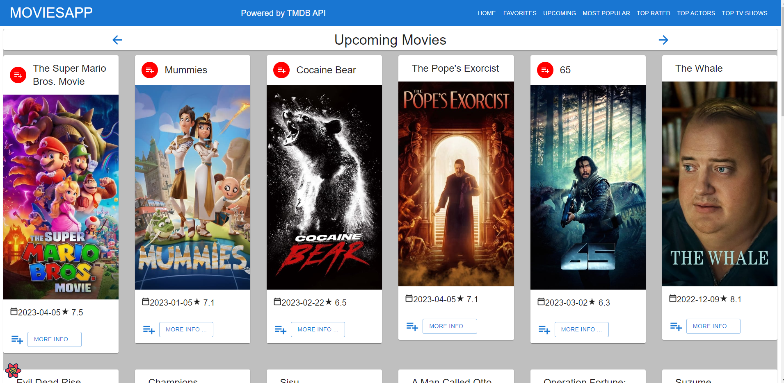

# Enterprise Web Development - Assignment 1.

__Name:__ Ilmam Farizan Auric

## Overview.

+ Added Add to Playlist button and show Playlist icon in Upcoming Movies page
+ Added more properties in the movie details page
+ Added more API functions
+ Added Most Popular Movies page
+ Added Top Rated Movies page
+ Added Top Actors page
+ Added Top Rated TV Shows page
+ Added a separate components for TV Shows
+ Added TV Show Details page
+ Updated Storybook

## Feature Design.

#### The Upcoming Movies feature.

> Lists movies from the Upcoming movies endpoint of TMDB

#### Movie Details feature.

> Shows more information on the movie details page.

![][image2]

#### Popular Movies feature.

> Shows Popular Movies lists on the Popular Movies page.

![][image3]

#### Top Rated Movies feature.

> Shows Top Rated Movies lists on the Top Rated Movies page.

![][image4]

#### Top Actors feature.

> Shows Top Actors lists on the Top Actors page.

![][image5]

#### Top Rated TV Show feature.

> Shows Top Rated TV Show lists on the Top Rated TV Show page.

![][image6]

#### TV Show Details feature.

> Shows Top Rated TV Show Details on the Top Rated TV Show Details page.

![][image7]

## Storybook.

![][image8]

![][image9]

![][image10]

![][image11]

![][image12]

## Authentication.

+ /movies - List of 20 movies from the Discover endpoint.
+ /movies/{movie_id} - Detailed information on a specific movie.
+ /reviews/{review_id} (Protected) - The full text of a movie review.
+ /movies/favourites - Display favourited movies.
+ /person/popular - Retrive top actors list.
+ /reviews/form - Display movie review form.
+ /movies/upcoming - Display upcoming movies.
+ /movies/top_rated - Display top rated movies.
+ /tv/top_rated - Retreive top rated tv shows.
+ /tv/:id - Detailed information on a specific tv show.